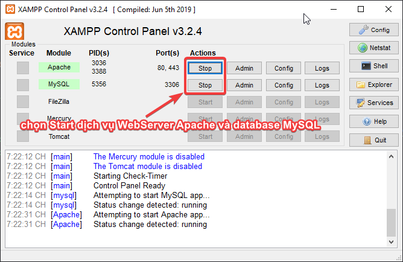

# Step 0: chuẩn bị môi trường demo
## Download source code
- Truy cập: [https://github.com/kellyfire611/workshop.ecommerce](https://github.com/kellyfire611/workshop.ecommerce)
- Download source code.
- Giải nén vào trong thư mục chạy WebServer XAMP: `c:\xampp\htdocs\`

## Khởi động dịch vụ WebServer XAMPP
- Vào `Start`->`Xampp`
- Chọn `Start` dịch vụ WebServer Apache
- Chọn `Start` dịch vụ Database MYSQL

## DONE! Hoàn thành.
[Tiếp tục qua Step 1 >>](step-1.md)