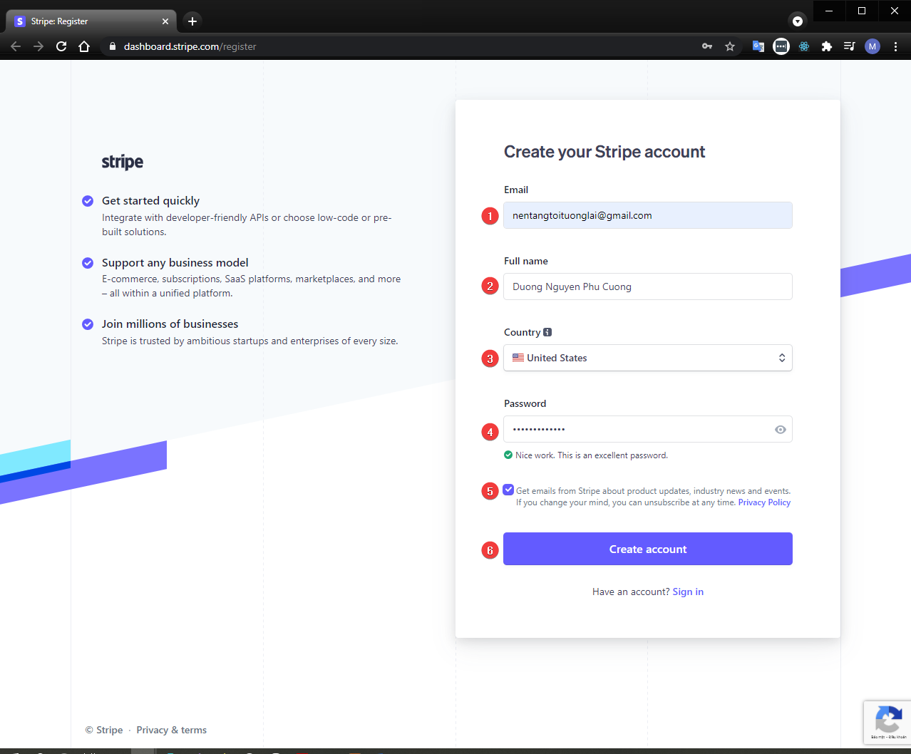
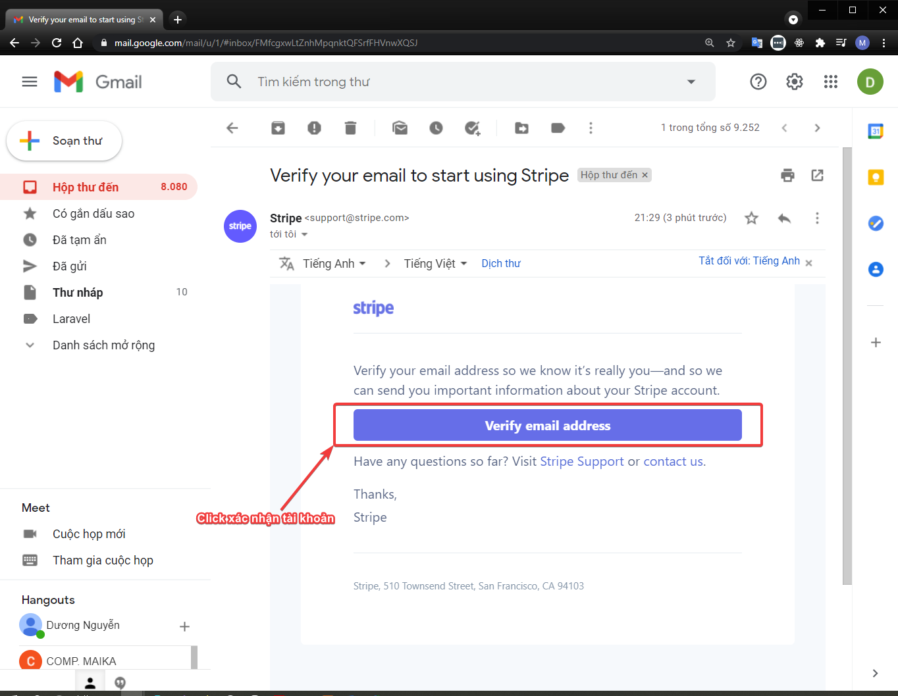

# Step 1: tạo tài khoản Stripe
## Đăng ký
- Truy cập: [https://stripe.com/register](https://stripe.com/register)

Điền thông tin theo yêu cầu của Stripe:
- `Email`: sử dụng email có thật, để nhận mail thông báo xác nhận tài khoản từ Stripe.
- `Full name`: sử dụng họ tên (tốt nhất là không dấu).
- `Country`: do Stripe chưa hỗ trợ VietNam, nên chọn sử dụng là `United States`
- `Password`: mật khẩu cần phải đủ mạnh (có chữ hoa, chữ thường, số, và ký tự đặc biệt)
- Đọc và check xác nhận điều khoản
- Chọn `Create Account`.

## Xác nhận tài khoản qua Email
- Truy cập vào EMAIL vừa tạo tài khoản để bấm xác nhận đăng ký tài khoản

## DONE! Hoàn thành.
[Tiếp tục qua Step 2 >>](step-2.md)