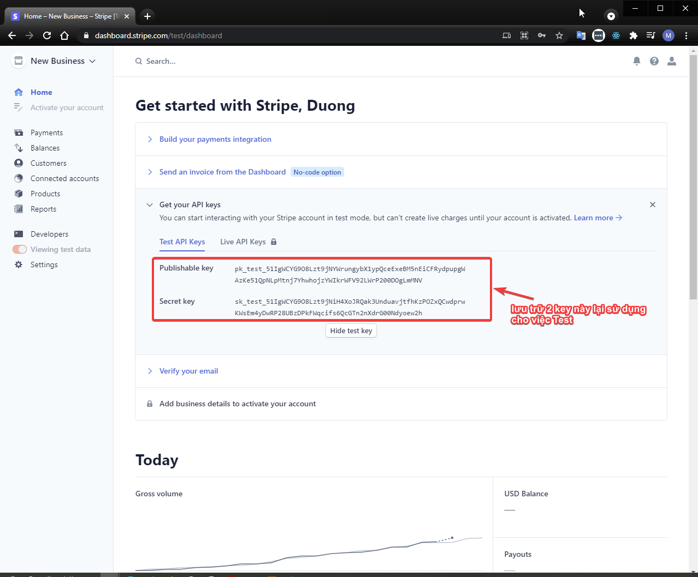

# Step 2: sử dụng màn hình Quản trị với Stripe
## Quản lý khóa Bí mật
- Truy cập: [https://dashboard.stripe.com/test/dashboard](https://dashboard.stripe.com/test/dashboard)

Lưu trữ lại 2 thông tin `Publishable key` và `Secret key` của Stripe:
- `Publishable key`: được sử dụng để gởi kèm theo từng request giao dịch đến Stripe.
- `Secret key`: sẽ được Stripe dùng để so sánh và tránh giả mạo giao dịch (tăng tính bảo mật).

## Đặt tên cho cổng thanh toán (TÊN CỬA HÀNG của người BÁN)
Stripe quy định người BÁN cần phải đặt tên cho cửa hàng của mình để tránh cho người MUA nhầm lẫn với những cửa hàng của các tài khoản khác.

- Truy cập vào trang Quản trị tài khoản của Stripe: [https://dashboard.stripe.com/test/dashboard](https://dashboard.stripe.com/test/dashboard)
- Chọn góc trên bên trái
- Đặt tên cho cửa hàng của người BÁN:
    - Tên cần ngắn gọn, súc tích
    - Không dấu, viết liền
- `Save`

## DONE! Hoàn thành.
[Tiếp tục qua Step 3 >>](step-3.md)