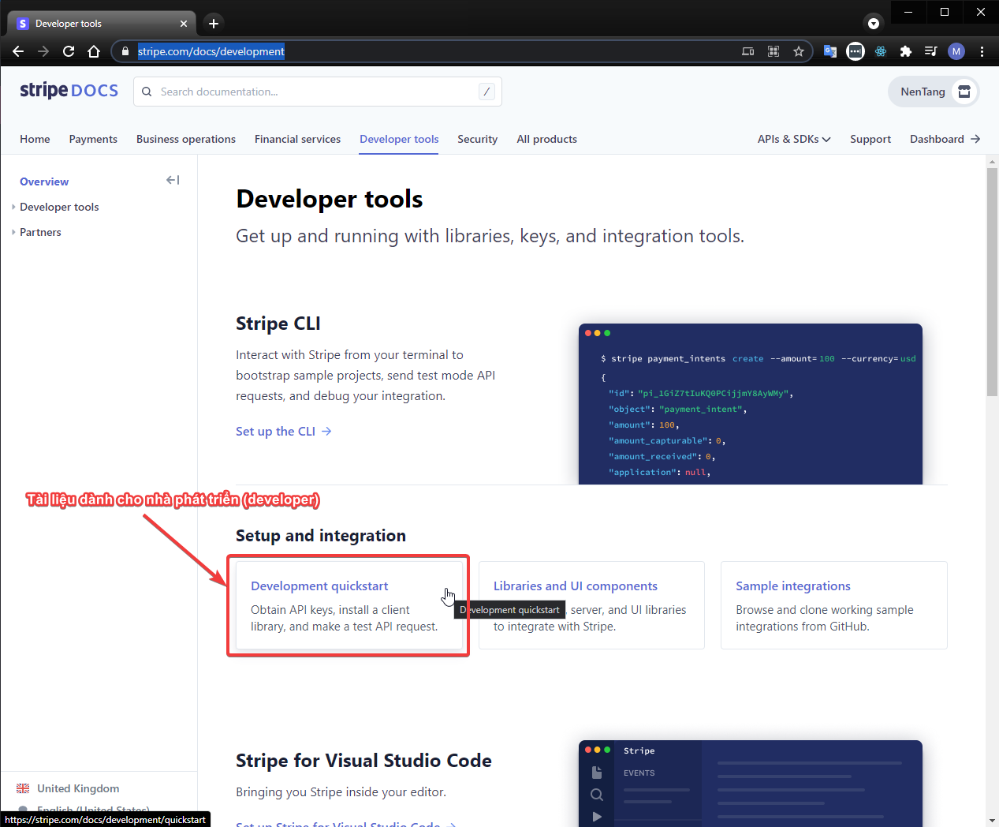
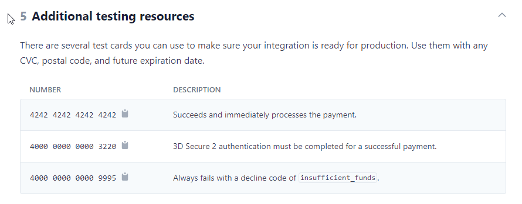

# Khởi tạo Database
- Download tool HeidiSQL: [https://www.heidisql.com/installers/HeidiSQL_11.2.0.6213_Setup.exe](https://www.heidisql.com/installers/HeidiSQL_11.2.0.6213_Setup.exe)
- Đảm bảo đã Khởi động MySQL Server
- Kết nối HeidiSQL và khởi tạo database mới với tên `admin_ws1`
- Chạy file script `db/ecommerce_db.sql` để khởi tạo db.

# Step 3: viết code tích hợp cổng thanh toán Stripe vào trang web
## Xem tài liệu dành cho Developer
- Truy cập: [https://stripe.com/docs/development](https://stripe.com/docs/development)



# Step 3.1: kết nối trang web với database vừa tạo
- Sử dụng `Visual Studio Code` để tiến hành viết code. [https://code.visualstudio.com/](https://code.visualstudio.com/)
- Mở `Visual Studio Code` -> `Open Folder` đến thư mục gốc của dự án `c:\xampp\htdocs\workshop.ecommerce`
- Hiệu chỉnh file thông số kết nối database `config.php` như sau:
```php
    public static $DB_CONNECTION_HOST           = 'localhost';
    public static $DB_CONNECTION_USERNAME       = 'root';
    public static $DB_CONNECTION_PASSWORD       = '';
    public static $DB_CONNECTION_DATABASE_NAME  = 'admin_ws1';
```

# Step 3.1: tạo AJAX gởi request cho STRIPE
- Sử dụng `Visual Studio Code` -> sử dụng `Open Folder` mở source code hiện tại `c:\xampp\htdocs\workshop.ecommerce`
- Tạo file tên `frontend/ajax/create-checkout-session.php`.
- Nội dung file:
```php
<?php
// Include file cấu hình ban đầu của `Twig`
require_once __DIR__ . '/../../bootstrap.php';

// Truy vấn database để lấy danh sách
// 1. Include file cấu hình kết nối đến database, khởi tạo kết nối $conn
include_once(__DIR__ . '/../../dbconnect.php');

// ************* Tích hợp cổng thông tin STRIPE thanh toán **************
// 2. Set khóa bí mật (secret key) để gởi yêu cầu Thanh toán đến Cổng thanh toán Stripe
// See your keys here: https://dashboard.stripe.com/apikeys
\Stripe\Stripe::setApiKey('sk_test_51IgWCYG9O8Lzt9jNiH4XoJRQak3UnduavjtfhKzPOZxQCwdprwKWsEm4yDwRP28UBzDPkFWqcifs6QcGTn2nXdrG00Ndyoew2h');

// 3. Gởi yêu cầu (request) đến Stripe
$stripeData = [
  'payment_method_types' => ['card'],
  'line_items' => [],
  'mode' => 'payment',
  'success_url' => 'http://workshop.ecommerce.nentang.vn/frontend/checkout/onepage-checkout-finish',
  'cancel_url' => 'http://workshop.ecommerce.nentang.vn/frontend/checkout/onepage-checkout-cancel',
  ];

foreach($_POST['sanphamgiohang'] as $sp) {
  $stripeData['line_items'][] = [
    'price_data' => [
      'currency' => 'vnd',
      'unit_amount' => round($sp['list_price_after_discount'], 0),
      'product_data' => [
        'name' => $sp['product_name'],
      ],
    ],
    'quantity' => round($sp['quantity']),
  ];
}

$session = \Stripe\Checkout\Session::create($stripeData);
echo json_encode([ 'id' => $session->id ]);
?>
```

### Lưu ý:
- Thay thế `http://workshop.ecommerce.nentang.vn` thành tên miền đang chạy của bạn, có thể là `http://localhost:1000/workshop.ecommerce/`
- Thay thế chỗ `setApiKey` thành secret key của bạn.

# Step 3.2: bổ sung nút Thanh toán bằng Stripe trên giao diện
- Mở file tên `templates/frontend/checkout/onepage-checkout.html.twig`.
- Bổ sung vào dòng `137` như sau:
```html
<button id="checkout-button" type="button" class="btn btn-success">Thanh toán với Stripe</button>
```

- Bổ sung dòng `147` đoạn code như sau:
```js
<script src="https://cdn.jsdelivr.net/npm/axios/dist/axios.min.js"></script>
<script src="https://js.stripe.com/v3/"></script>
<script type="text/javascript">
    function serialize (data) {
        let obj = {};
        for (let [key, value] of data) {
            if (obj[key] !== undefined) {
                if (!Array.isArray(obj[key])) {
                    obj[key] = [obj[key]];
                }
                obj[key].push(value);
            } else {
                obj[key] = value;
            }
        }
        return obj;
    }

    // Chuẩn bị dữ liệu Giỏ hàng để gởi đến cổng thanh toán Stripe
    // Get the form
    let form = document.querySelector('#frmCheckOut');
    // Get all field data from the form
    let data = new FormData(form);
    // Convert to an object
    let sendData = serialize(data);

    // Create an instance of the Stripe object with your publishable API key
    var stripe = Stripe('pk_test_51IgWCYG9O8Lzt9jNYWrungybX1ypQceExeBM5nEiCFRydpupgWAzKe51QpNLpMtnj7YhwhojzYWIkrWFV92LWrP200DOgLmMNV');
    var checkoutButton = document.getElementById('checkout-button');

    checkoutButton.addEventListener('click', function() {
    $.ajax({
        url: '/frontend/ajax/create-checkout-session',
        method: "POST",
        dataType: 'json',
        data: sendData,
        success: function (session) {
            return stripe.redirectToCheckout({ sessionId: session.id });
        },
        error: function (jqXHR, textStatus, errorThrown) {
            console.log(textStatus, errorThrown);
            // Hiện thông báo
            alert(errorThrown);
        }
    });
});
</script>
```

### Lưu ý:
- Thay thế `http://workshop.ecommerce.nentang.vn` thành tên miền đang chạy của bạn, có thể là `http://localhost:1000/workshop.ecommerce/`
- Thay thế chỗ `var stripe = Stripe()` thành publishable key của bạn.

## DONE! Hoàn thành.
Thưởng thức DEMO
- Truy cập: `http://localhost:8000/workshop.ecommerce` để tiến hành đặt hàng.
  - Dữ liệu CARD test:
  
- Truy cập trang quản trị của Stripe để xem thông tin các đợt giao dịch đã phát sinh: [https://dashboard.stripe.com/test/dashboard](https://dashboard.stripe.com/test/dashboard)
